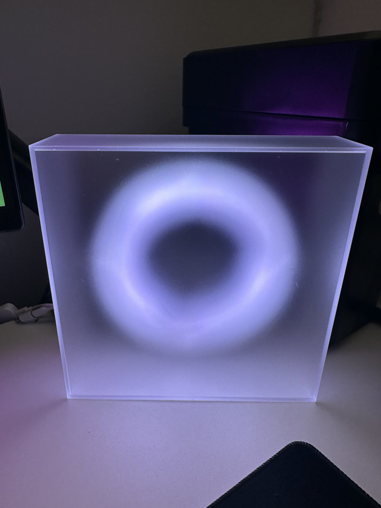

# Codex Moonside Lamp

Make a Moonside Halo lamp show local Codex status using Codex lifecycle hooks and BLE.

```text
Codex hook event
  -> codex-moonside-hook
  -> /tmp/codex_moonside_state.json
  -> codex-moonside-daemon
  -> Moonside lamp over local BLE
```

The hook exits quickly and never talks to BLE. The daemon owns the persistent BLE connection and watches the state file.

## Demo


[Watch the MP4 demo](docs/media/demo.mp4)



## Status

Alpha, tested locally.

Tested setup:

- macOS
- Python 3.12
- Codex local app/CLI hooks with `codex_hooks = true`
- Moonside Halo advertising as `MOONSIDE-O101`

Linux may work if `bleak` can access the Bluetooth adapter. Windows is not a target.

## Behavior

| Codex event | Lamp state | Default visual |
| --- | --- | --- |
| `SessionStart` | `idle` | warm solid color |
| `UserPromptSubmit` | `working` | animated `BEAT2` |
| `PermissionRequest` | `attention` | purple gradient approval-needed signal |
| matching `PostToolUse` after approval | `working` | return to working |
| `Stop` | `tool_done` | green finish flash, then idle |

Tool-use events are intentionally not used as normal status changes. This keeps the lamp calmer during long responses.

When multiple Codex chats are open, the hook uses an active-session lock:

- the latest prompt claims the lamp
- other sessions cannot force idle while that session is active
- permission state cannot be overwritten by another session
- the active session releases the lock on `Stop`

Codex currently does not expose a distinct “user clicked approve” hook. This project treats the matching `PostToolUse` after a permission request as the approval-resolved signal.

## Install

```bash
git clone <repo-url>
cd codex-moonside-lamp
scripts/setup-local
source .venv/bin/activate
```

Create the default config:

```bash
python install_hooks.py --write-config
```

This writes `~/.codex-moonside-lamp/config.json` if missing.

## BLE Setup

Scan nearby BLE devices:

```bash
codex-moonside-daemon --scan
```

Likely Moonside devices are marked with `*`. On macOS, BLE addresses are usually UUID-like identifiers rather than stable MAC addresses.

If multiple Moonside lamps are nearby, copy the address from `--scan` into:

```json
{
  "ble_address": "YOUR-SCANNED-ADDRESS"
}
```

Test the lamp:

```bash
codex-moonside-daemon --test-state attention
```

Raw command testing is useful for tuning effects:

```bash
codex-moonside-daemon --raw-command LEDON --raw-command BRIGH070 --raw-command 'THEME.GRADIENT1.180,0,255,40,0,120'
```

## Codex Hooks

Enable Codex hooks in `~/.codex/config.toml`:

```toml
[features]
codex_hooks = true
```

Generate hook JSON using the absolute path to your local hook executable:

```bash
python install_hooks.py --print-hooks
```

Install global Codex hooks if you do not already have a custom `~/.codex/hooks.json`:

```bash
python install_hooks.py --write-hooks
```

Use `--force` only if you want to overwrite the existing hooks file:

```bash
python install_hooks.py --write-hooks --force
```

Restart Codex after changing hook configuration.

## Run

Foreground daemon:

```bash
codex-moonside-daemon
```

Logs:

```text
~/.codex-moonside-lamp/daemon.log
~/.codex-moonside-lamp/hook.log
```

## macOS Autostart

Install a user LaunchAgent so the daemon starts when you log in:

```bash
scripts/install-macos-service
```

The installer copies runtime code to `~/.codex-moonside-lamp/runtime` because macOS may block LaunchAgents from executing code inside protected folders such as `Documents`.

Check service status:

```bash
launchctl print gui/$(id -u)/local.codex-moonside-lamp
tail -f ~/.codex-moonside-lamp/daemon.log
```

Uninstall the LaunchAgent:

```bash
scripts/uninstall-macos-service
```

If daemon code changes after installing the LaunchAgent, rerun:

```bash
scripts/install-macos-service
```

## Config

Default config path:

```text
~/.codex-moonside-lamp/config.json
```

Important fields:

```json
{
  "state_file": "/tmp/codex_moonside_state.json",
  "permission_file": "/tmp/codex_moonside_permission_pending.json",
  "session_lock_file": "/tmp/codex_moonside_active_session.json",
  "session_lock_enabled": true,
  "lamp_name_contains": "Moonside",
  "ble_address": null,
  "poll_interval_seconds": 0.2,
  "reconnect_interval_seconds": 3,
  "command_delay_seconds": 0.25,
  "write_response": true,
  "skip_redundant_commands": true,
  "minimum_attention_seconds": 1.0,
  "ambient_after_idle_seconds": 1800,
  "ambient_state": "ambient"
}
```

Default attention effect:

```json
{
  "attention": {
    "commands": ["LEDON", "BRIGH070", "THEME.GRADIENT1.180,0,255,40,0,120"]
  }
}
```

Default ambient effect after 30 minutes idle:

```json
{
  "ambient": {
    "commands": ["LEDON", "BRIGH070", "THEME.RAINBOW3.0"]
  }
}
```

Moonside command strings are reverse-engineered and empirical. If a theme does not work, switch that state to simple commands such as `LEDON`, `BRIGH060`, and `COLOR255120040`.

## Privacy

This project is local-only:

- no Moonside cloud API
- no external server
- no prompt text in state files
- no command output in state files
- no file contents in state files

The hook stores only minimal state metadata such as event name, session id, tool name, working directory, and timestamp.

## Troubleshooting

If scanning prints `Bluetooth is not available to Bleak`, verify:

- Bluetooth is enabled
- the terminal/app running Python has Bluetooth permission in macOS Privacy & Security
- you are running on the host macOS session, not a remote/containerized shell

If the LaunchAgent is loaded but the lamp does not connect, check:

```bash
tail -f ~/.codex-moonside-lamp/launchd.stderr.log
tail -f ~/.codex-moonside-lamp/daemon.log
```

Only one daemon should own the lamp BLE connection. Stop any foreground `codex-moonside-daemon` before relying on the LaunchAgent.

## Development

```bash
python3 -B -m unittest discover -s tests
python3 -B -m py_compile codex_moonside/*.py install_hooks.py
```

## Prior Art

- `bobek-balinek/claude-lamp`: Claude Code status integration for Moonside lamps.
- TheGreyDiamond Moonside reverse-engineering notes and BLE connector examples.
- Codex hooks documentation and the `codex_hooks` feature flag.

## License

MIT
